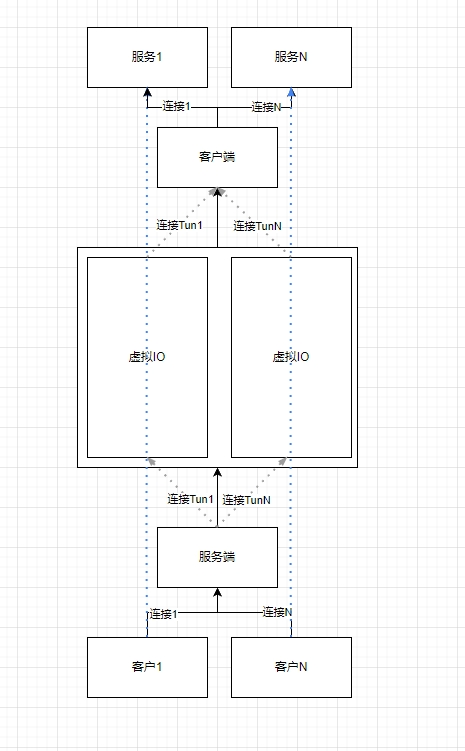

## 需求
1. 多个客户端可以共用一个服务端的端口,由服务端控制数据流向(例如根据注册信息)
2. 验证由服务端控制,验证客户端
3. 通过服务端来控制流向,客户端可选更改流向,例如将带参数sn=001的请求转发到001客户端

## 虚拟IO
1. 一个IO,通过数据包拆分成无数个IO
2. 数据包里面包含IO的标识,表示这个数据包标识的虚拟IO
3. 目前实现了TCP的IO

4. 示意图




## 如何使用

#### 1. 端口转发

```go
package main

import (
	"github.com/injoyai/proxy/core"
	"github.com/injoyai/proxy/forward"
)

//将本地端口20002的TCP数据转发至局域网192.168.10.187:10001上
func main() {
	f := forward.Forward{
		Listen:  core.NewListenTCP("20002"),
		Forward: core.NewDialTCP("192.168.10.187:10001"),
	}
	f.ListenTCP()
}

```

#### 2. 远程代理

```go
package main

import (
	"fmt"
	"github.com/injoyai/proxy/core"
	"github.com/injoyai/proxy/core/virtual"
	"github.com/injoyai/proxy/proxy"
	"io"
)

// 客户端先通过7000端口连接到服务端,然后进行注册监听20001端口
// 服务端监20001端口数据转发至客户端的80端口
// 客户端可以在不同主机上运行,进而实现远程代理功能
func main() {
	s := proxy.Server{
		Listen: core.NewListenTCP("7000"),
		OnProxy: func(r io.ReadWriteCloser) (*core.Dial, []byte, error) {
			//监听服务的数据,转发至客户端的80端口
			return core.NewDialTCP(":80"), nil, nil
		},
		OnRegister: func(r io.ReadWriteCloser, v *virtual.Virtual, reg *virtual.RegisterReq) error {
			//客户端与服务端建立连接,并上报注册信息,验证失败则返回错误
			fmt.Println("注册信息: ", r)
			return nil
		},
	}
	go s.Run()

	c := proxy.Client{
		Dial: core.NewDialTCP("127.0.0.1:7000"),
		Register: &virtual.RegisterReq{
			//向服务端请求监听20001端口
			Listen:   core.NewListenTCP("20001"),
			//一些注册信息
			Username: "username",
			Password: "password",
		},
	}
	c.DialTCP()
}

```

