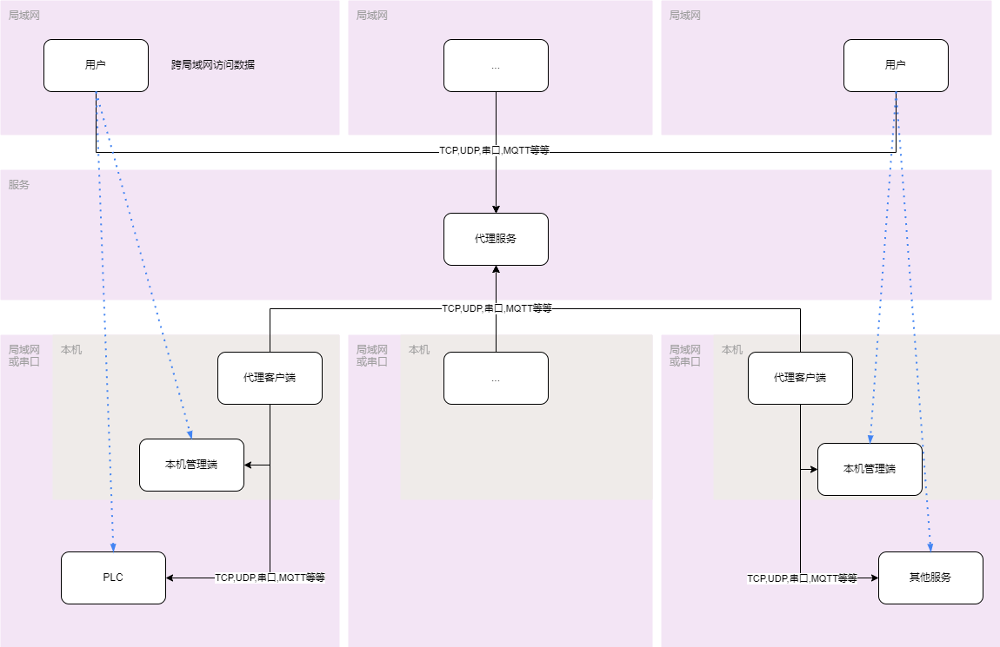
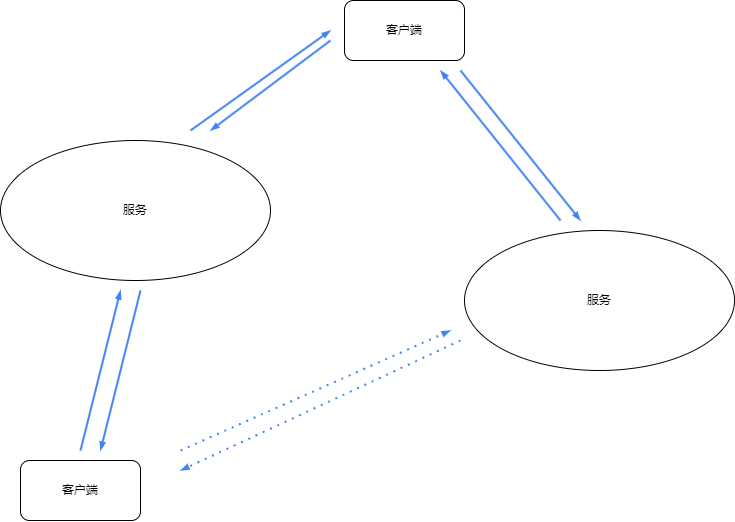

## 初衷
###### 项目上遇到的需求是这样的,
###### 需要对设备(单片机/边缘网关)进行远程访问,远程管理,有很多个设备(单片机/边缘网关)会连接到服务器上面,
###### 这些设备属于不通的客户/项目,不同的客户端在服务上访问属于自己的设备,固所有的设备监听同一个端口,通过服务端分配设备的桥接工作
###### 例如HTTP协议,当选择设备001时,所有的请求都带上参数SN=001,就能区分想要访问的设备,从而实现不同用户统一地址访问不同的设备
###### 例如PLC的远程升级,可以通过服务端桥接到对应的设备,通过设备的转发功能,转发到局域网对应的PLC上,从而实现远程升级




## 需求
1. 多个客户端可以共用一个服务端的端口,由服务端控制数据流向(例如根据注册信息)
2. 验证由服务端控制,验证客户端
3. 通过服务端来控制流向,客户端可选更改流向,例如将带参数sn=001的请求转发到001客户端

## 如何使用

### 1. 命令方式
1. 端口转发,例`80`端口转到`8080` 
    ```shell
    proxy.exe forward "80->:8080"
    ```

2. 端口转发,例`80`端口转到局域网的`8080`端口 
    ```shell
    proxy.exe forward "80->:192.168.1.3:8080"
    ```

3. 代理服务端,例监听`7000`端口用于客户端连接,监听`80`端口转发至客户端的`8080`端口 
    ``` shell
    proxy.exe server -p=7000 "80->:8080"
    ```

4. 代理客户端,例连接到`8.8.8.8:7000`上,请求监听服务的`80`端口,转发到本地的`8080`端口,请求验证的账号密码是`test`
    ```shell
    proxy.exe client 8.8.8.8:7000 "80->:8080" --username=test --password=test
    ```

### 2. 代码方式
#### 2.1 端口转发

```go
package main

import (
	"github.com/injoyai/proxy/core"
	"github.com/injoyai/proxy/forward"
)

//将本地端口20002的TCP数据转发至局域网192.168.10.187:10001上
func main() {
	f := forward.Forward{
		Listen:  core.NewListenTCP("20002"),
		Forward: core.NewDialTCP("192.168.10.187:10001"),
	}
	f.ListenTCP()
}

```

#### 2.2 远程代理

```go
package main

import (
	"fmt"
	"github.com/injoyai/proxy/core"
	"github.com/injoyai/proxy/core/virtual"
	"github.com/injoyai/proxy/proxy"
	"io"
)

// 客户端先通过7000端口连接到服务端,然后进行注册监听20001端口
// 服务端监20001端口数据转发至客户端的80端口
// 客户端可以在不同主机上运行,进而实现远程代理功能
func main() {
	s := proxy.Server{
		Listen: core.NewListenTCP("7000"),
		OnProxy: func(r io.ReadWriteCloser) (*core.Dial, []byte, error) {
			//监听服务的数据,转发至客户端的80端口
			return core.NewDialTCP(":80"), nil, nil
		},
		OnRegister: func(r io.ReadWriteCloser, v *virtual.Virtual, reg *virtual.RegisterReq) error {
			//客户端与服务端建立连接,并上报注册信息,验证失败则返回错误
			fmt.Println("注册信息: ", r)
			return nil
		},
	}
	go s.Run()

	c := proxy.Client{
		Dial: core.NewDialTCP("127.0.0.1:7000"),
		Register: &virtual.RegisterReq{
			//向服务端请求监听20001端口
			Listen:   core.NewListenTCP("20001"),
			//一些注册信息
			Username: "username",
			Password: "password",
		},
	}
	c.DialTCP()
}

```

