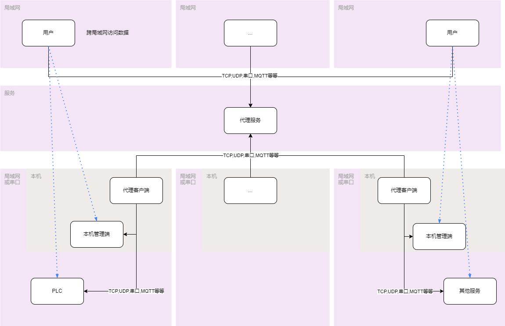

# Proxy

一个基于 Go 的轻量级隧道代理框架，支持多客户端连接、端口转发、内网穿透等功能。

## 项目简介

本项目旨在解决远程设备管理和访问的需求。多个设备（单片机/边缘网关）可以连接到同一个服务端，通过隧道协议进行数据转发和桥接，实现：

- **多客户端共享端口**：多个客户端复用服务端同一个端口，由服务端控制数据流向
- **客户端认证**：服务端可验证客户端身份
- **灵活转发**：支持端口转发、隧道代理、内网穿透
- **自定义协议**：支持自定义帧协议和数据转换



## 核心概念

| 概念             | 说明                              |
|----------------|---------------------------------|
| **Tunnel（隧道）** | 一条物理连接，承载多条虚拟 IO，负责帧协议的编解码和消息路由 |
| **IO（虚拟通道）**   | 隧道内的独立虚拟通道，多条 IO 复用同一条物理连接      |
| **Frame（帧协议）** | 隧道通信的二进制协议，包含帧头、消息 ID、控制码和数据    |
| **Dial（拨号）**   | 描述如何建立一条到目标地址的连接                |
| **Listen（监听）** | 描述如何在本地监听客户端连接                  |

## 项目结构

```
proxy/
├── core/          # 核心包
│   ├── frame.go   # 帧协议定义（Packet / Frame）
│   ├── io.go      # 虚拟 IO（IO）
│   ├── model.go   # 数据模型（Dial / Listen / RegisterReq）
│   ├── tunnel.go  # 隧道核心（Tunnel）
│   ├── option.go  # 隧道配置选项（OptionTunnel）
│   ├── listen.go  # 网络监听（Listen 方法 / 辅助函数）
│   ├── util.go    # 工具函数（Bridge / DefaultDial）
│   └── err.go     # 预定义错误
├── tunnel/        # 隧道客户端和服务端
├── forward/       # 端口转发
├── special/       # 特殊模式（隧道和代理共用端口）
└── example/       # 示例代码
```

## 快速开始

### 1. 端口转发

将本地端口流量转发到目标地址，适用于局域网端口映射：

```go
package main

import (
	"context"
	"github.com/injoyai/proxy/core"
	"github.com/injoyai/proxy/forward"
)

func main() {
	// 将本地 20002 端口的 TCP 流量转发到 192.168.10.187:10001
	f := forward.Forward{
		Listen:  core.NewListenTCP(20002),
		Forward: core.NewDialTCP("192.168.10.187:10001"),
	}
	f.Run(context.Background())
}
```

### 2. 隧道代理

隧道代理由服务端和客户端组成，客户端通过隧道暴露内网服务：

#### 服务端

```go
package main

import (
	"context"
	"github.com/injoyai/proxy/core"
	"github.com/injoyai/proxy/tunnel"
)

func main() {
	s := tunnel.Server{
		Listen: core.NewListenTCP(7000),
		OnRegister: func(tun *core.Tunnel, reg *core.RegisterReqExtend) error {
			// 验证客户端注册信息
			// 返回 nil 表示通过，返回 error 表示拒绝
			return nil
		},
	}
	s.Run(context.Background())
}
```

#### 客户端

```go
package main

import (
	"github.com/injoyai/proxy/core"
	"github.com/injoyai/proxy/tunnel"
	"time"
)

func main() {
	c := tunnel.Client{
		Dialer: &core.Dial{
			Address: "127.0.0.1:7000",
			Timeout: time.Second * 2,
		},
		Register: &core.RegisterReq{
			Listen:   core.NewListenTCP(20001), // 请求服务端监听 20001 端口
			Username: "username",
			Password: "password",
		},
	}
	// 服务端收到外部连接后，转发到本地的 80 端口
	c.Run(core.WithDialTCP(":80"))
}
```

### 3. 特殊模式

隧道和代理共用同一个端口，根据帧头 `0x8989` 自动识别是隧道连接还是普通代理连接：

```go
package main

import (
	"fmt"
	"github.com/injoyai/proxy/core"
	"github.com/injoyai/proxy/special"
)

func main() {
	s := special.New(
		special.WithPort(7001),
		special.WithAddress(":80"),
		special.WithRegister(func(tun *core.Tunnel, reg *core.RegisterReqExtend) error {
			fmt.Printf("[%s] 注册成功\n", tun.Key())
			return nil
		}),
	)
	s.Run()
}
```

## 协议说明

### 帧格式

```
┌──────┬──────┬──────────┬───────┬───┬──────┬──────┐
│0x89  │0x89  │ 长度(4B) │ MsgID │ # │ Code │ Data │
└──────┴──────┴──────────┴───────┴───┴──────┴──────┘
```

| 字段          | 说明                       |
|-------------|--------------------------|
| `0x89 0x89` | 帧头标识，用于定位帧起始位置           |
| 长度(4字节)     | MsgID + Code + Data 的总长度 |
| MsgID       | 消息唯一标识，用于关联请求和响应         |
| `#`         | 字段分隔符                    |
| Code        | 控制码，包含消息类型、方向、状态         |
| Data        | 负载数据                     |

### 消息类型

| 类型       | 值    | 说明                |
|----------|------|-------------------|
| Register | 0x00 | 注册消息，客户端向服务端注册身份  |
| Open     | 0x01 | 打开连接，请求建立一条新的虚拟通道 |
| Close    | 0x02 | 关闭连接，通知对端关闭某条虚拟通道 |
| Read     | 0x03 | 读取数据，从虚拟 IO 中读取数据 |
| Write    | 0x04 | 写入数据，向虚拟 IO 中写入数据 |

### 控制码位定义

| 位   | 值    | 说明               |
|-----|------|------------------|
| 最高位 | 0x80 | 0=请求，1=响应        |
| 第6位 | 0x40 | 响应时使用，0=成功，1=失败  |
| 第5位 | 0x20 | 请求时使用，标记是否需要对方回复 |
| 低4位 | 0x0F | 消息类型             |

## License

MIT
